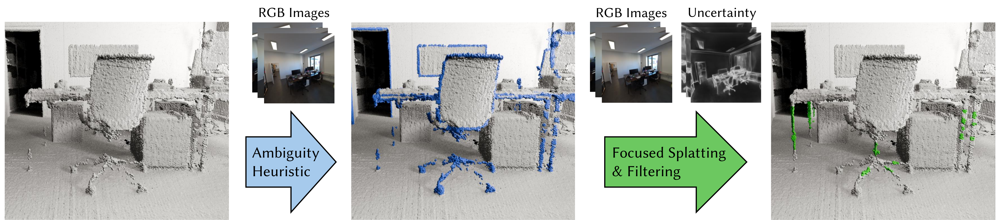

# SurfFill: Completion of LiDAR Point Clouds via Gaussian Surfel Splatting

[Project page](https://lfranke.github.io/surffill/) • [Paper](https://arxiv.org/abs/2512.03010) • [Video](https://www.youtube.com/watch?v=OS3q5OWT-sg)



This repository contains the **official implementation** of the paper  
**_SurfFill: Completion of LiDAR Point Clouds via Gaussian Surfel Splatting_**.

Our work improves the completeness of LiDAR point clouds by combining the initial LiDAR points with selected points reconstructed using **2D Gaussian Splatting**.

---

## Installation

**Tested with:**
- CUDA 12.8
- PyTorch 2.9.1+cu128
- Python 3.10

#### 1. Clone the repository (with submodules)

```bash
git clone https://github.com/hbb1/surffill.git --recursive
cd surffill
```

#### 2. Set up Python environment
```bash
pipenv --python 3.10
pipenv shell
```
#### 3. Install PyTorch (CUDA 12.8)
```bash
pip install torch torchvision torchaudio \
  --index-url https://download.pytorch.org/whl/cu128
```
#### 4. Install additional dependencies
```bash
pip install ffmpeg pillow open3d mediapy lpips \
            scikit-image tqdm trimesh plyfile opencv-python
```
#### 5. Install submodules

```bash
cd submodules/diff-surfel-rasterization
pipenv run python setup.py install
cd ../..

cd submodules/simple-knn
pipenv run python setup.py install
cd ../..
```
#### 6. Download pretrained checkpoint

Download scannet.pt from:
https://huggingface.co/ckpt/ControlNet-v1-1/blob/2e01957f9da7799e4c669811c08d1617bdae51bd/scannet.pt

Place it at: 
```bash
SurfFill/checkpoints/scannet.pt
```
---
## Training

To train a scene, run:
```bash
PYTHONPATH=. python train.py -s <path_to_COLMAP_or_NeRF_dataset>
```
#### Quick Example

Assuming you have downloaded our preprocessed TnT [Caterpillar](https://drive.google.com/file/d/1ux2zeImxzR1NhM6jIvBZlauUXAAOi78Z/view) demo scene, run:
```bash
PYTHONPATH=. python train.py \
  -s <path_to_caterpillar_dataset>/<demo> \
  --scene_name caterpillar
```
#### Custom Dataset

SurfFill uses the same COLMAP loader as 3DGS and can read data in both COLMAP and Blender / NeRF Synthetic formats.
#### COLMAP format
```bash
/data_dir
├── images/
├── sparse/
│   └── 0/
│       ├── cameras.txt
│       └── images.txt
└── lidar_pointcloud.ply
```
#### Blender / NeRF Synthetic format
```bash
/data_dir
├── images/
├── transforms_train.json
├── transforms_test.json   (optional)
└── lidar_pointcloud.ply
```
Note: File paths in JSON must include the .jpg / .png extension.

#### Training Parameters & Tuning

Training parameters are defined in:
```bash
arguments/__init__.py
```
Parameters that may require tuning:

- Preprocessing resolution: self.w, self.h → should match training image resolution
- Curvature threshold: self.curvature_threshold_preprocessing → range 0–1. Tune to separate high- vs low-curvature regions in points3D.ply after subsampling
- Filtering parameters: may require adjustment depending on LiDAR noise and dataset characteristics
---
## Acknowledgements

This project is built upon [2DGS](https://github.com/hbb1/2d-gaussian-splatting).

## Citation

If you find our code or paper helps, please consider citing:
```bibtex
@misc{strobel2025surffill,
  author       = {Svenja Strobel and Matthias Innmann and Bernhard Egger and 
                 Marc Stamminger and Linus Franke},
  title        = {{SurfFill}: Completion of LiDAR Point Clouds via Gaussian Surfel Splatting},
  month        = {Dez},
  eprint       = {2512.03010},
  archivePrefix= {arXiv},
  primaryClass = {cs.CV},
  year         = {2025},
  url          = {https://lfranke.github.io/surffill}
}
```


